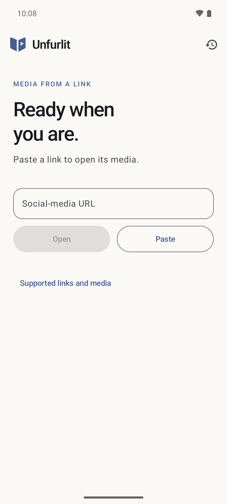
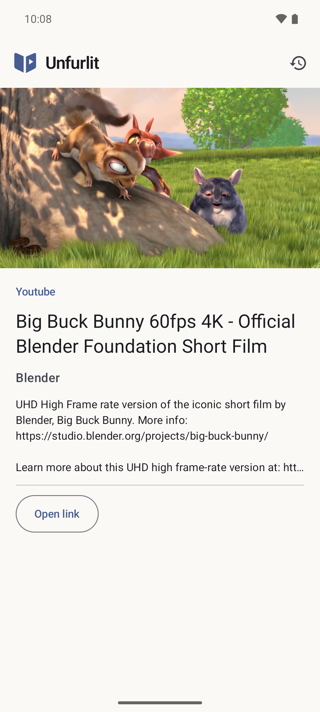
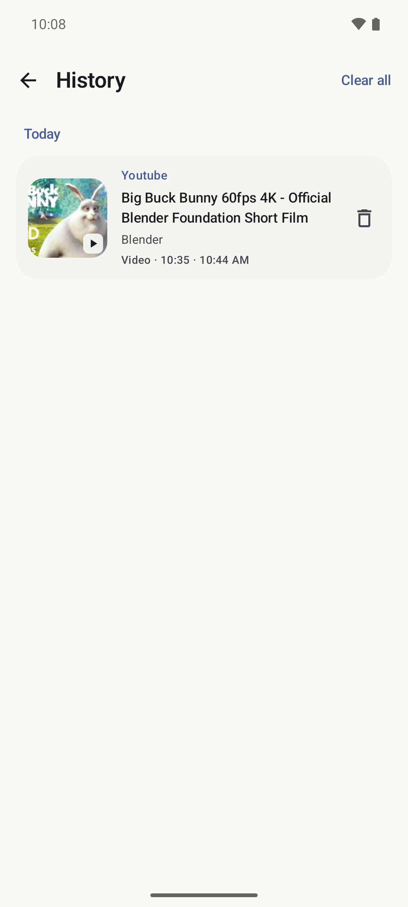
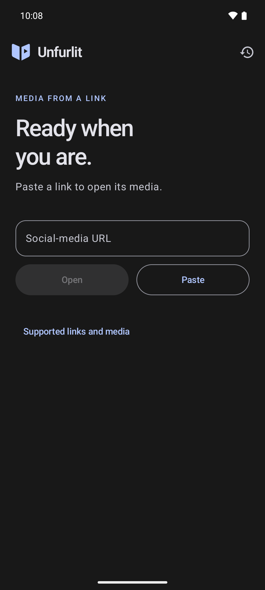

# Unfurlit

Watch videos, view photos, and play audio from social links in a native Android viewer.
Paste a link or share it to Unfurlit to open its media without using the official app or the limited online website.

**Android 7.0+** · [Installation](docs/usage.md#installation) · [Privacy](PRIVACY.md) · [Documentation](docs/README.md)

| Open a link | Watch | Revisit | Dark mode |
| :---: | :---: | :---: | :---: |
|  |  |  |  |

## Features

- Open public links from **YouTube, Instagram, TikTok, Reddit, X/Twitter, PeerTube**, and more.
- Watch fullscreen videos and audio, zoom into photos, with gallery/carousel support.
- Revisit media in **local history**.

Media extraction runs **on your device**, with no account, backend or ads.
Site availability varies; [supported content and limitations](docs/usage.md#sites-and-access) explain what to expect.

## Supported links and media

- YouTube: videos.
- Instagram: Reels, photos and carousels (no photo-post soundtracks).
- TikTok: videos and photo posts, including available photo soundtracks.
- Reddit and X/Twitter: videos.
- PeerTube: videos.
- Reddit, X/Twitter, Imgur, Bluesky, Pixiv and many other sites: photos and
  galleries through the bundled [gallery-dl](https://github.com/mikf/gallery-dl)
  engine, used when a post has no video. New; not yet checked on live links.

Other sites may work too; audio and galleries depend on the source. Availability varies by post,
region and platform changes. Private, login-gated or restricted posts may not
open; signing in is not available.

## Site compatibility

**Last checked: 2026-09-17** · Two initial public links per site, plus additional Instagram and TikTok photo posts; without signing in.

| Results for tested links | Sites | Notes |
| --- | --- | --- |
| Working | Reddit, Instagram videos/reels | Both links extracted successfully on each site. |
| Working | Instagram photos | The 11-photo and eight-photo examples opened successfully. Photo-post soundtracks are not supported. |
| Working | TikTok photos with audio | One post checked: three swipeable photos and a playing soundtrack. |
| Sometimes troublesome | YouTube, X/Twitter, TikTok videos | One of two links worked on each site. The other YouTube video was unavailable; X and TikTok had extraction failures. |
| Troublesome | Vimeo | Neither link worked: one required sign-in, the other was blocked by the site. |

These are checks on an Android emulator, not site-wide guarantees. The initial
cases check extraction; the photo posts had image display and swiping checked, and the TikTok post
also had audio playback checked. Other sites, including PeerTube, were not checked in this
run. See the [detailed results](docs/social-link-baseline.md) and
[live test pipeline](docs/development.md#social-link-regression-pipeline).

[Report a bug](https://github.com/originalRecipe1/unfurlit/issues) · [Build from source](docs/development.md#build) · [GPL-3.0-only](LICENSE)
