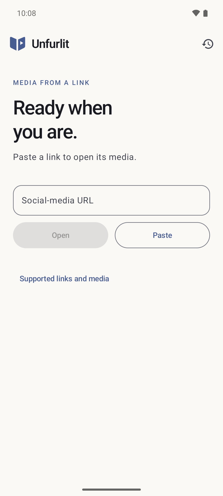
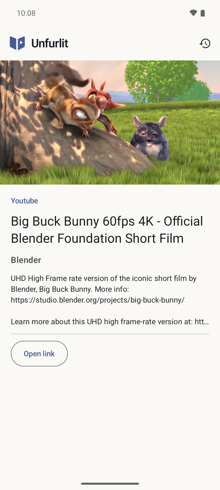
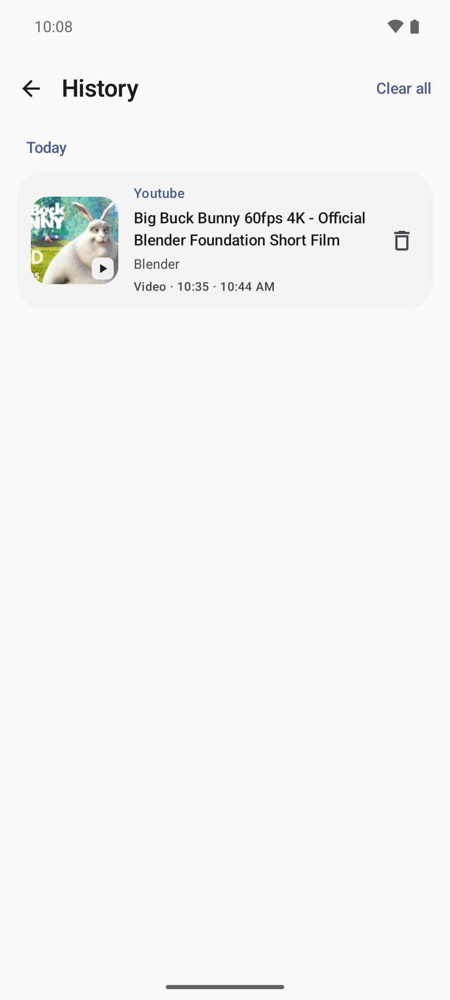
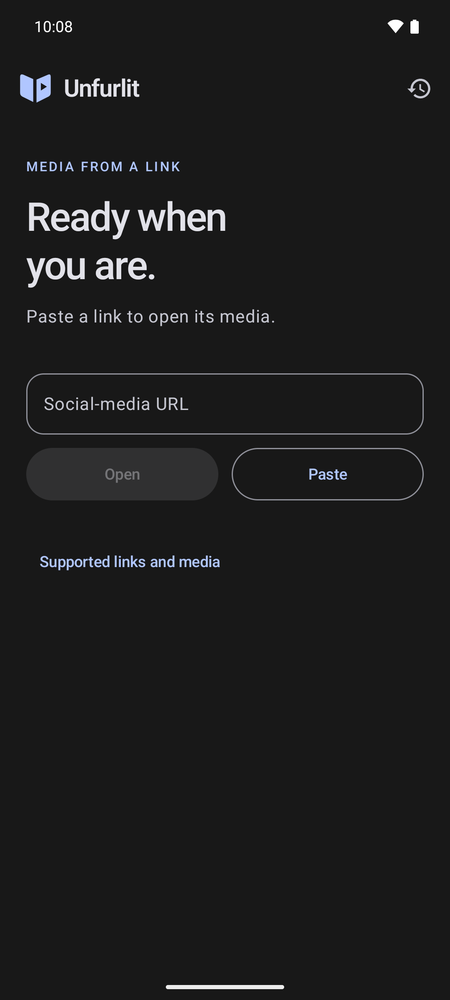

# Unfurlit

Watch videos, view photos, and play audio from social links in a native Android viewer.
Paste a link or share it to Unfurlit to open its media without using the official app or the limited online website.

**Android 7.0+** · [Installation](docs/usage.md#installation) · [Privacy](PRIVACY.md) · [Documentation](docs/README.md)

| Open a link | Watch | Revisit | Dark mode |
| :---: | :---: | :---: | :---: |
|  |  |  |  |

## Features

- Open public links from **YouTube, Vimeo, Instagram, TikTok, Reddit, X/Twitter, PeerTube, Bandcamp**, and more.
- Watch fullscreen videos and audio, zoom into photos, with gallery/carousel support.
- Revisit media in **local history**.

Media extraction runs **on your device**, with no account, backend or ads.
Site availability varies; [supported content and limitations](docs/usage.md#sites-and-access) explain what to expect.

## Supported links and media

- YouTube: videos and Shorts.
- Vimeo: videos, including page links and unlisted links with an access hash.
- Instagram: videos, Reels, photos and carousels (no photo-post soundtracks).
- TikTok: videos and photo posts, including available photo soundtracks.
- Reddit: videos, photos and galleries, including gallery posts opened from share,
  comments and `redd.it` short links.
- X/Twitter: videos, photos and galleries.
- PeerTube: videos.
- Bandcamp: audio tracks.
- Tumblr: native videos, photos and mixed photo/video posts.
- Pixiv: public illustrations and multi-page artwork (no Ugoira animations).
- Imgur, Bluesky, Flickr and many other sites: photos and galleries.

TikTok, Instagram, Tumblr and Pixiv photo posts use Unfurlit's own extractors (TikTok including
the post's soundtrack). Instagram falls back to the bundled
[gallery-dl](https://github.com/mikf/gallery-dl) engine if that fails, as do photos
and galleries on other sites. Direct image links also open. See the
[dated test results](docs/social-link-baseline.md) for the links and media checked.

Other sites may work too; audio and galleries depend on the source. Availability varies by post,
region and platform changes. Private, login-gated or restricted posts may not
open; signing in is not available.

## Site compatibility

On **2026-10-06**, the full local emulator run of **1.3.1** passed **57/62
cases**, including 5 expected-error checks. Media cases check extraction, image
rendering and short playback samples. Known issues in that release were
[missing photos in X mixed-media posts (#37)](https://github.com/originalRecipe1/unfurlit/issues/37),
[Tumblr connection failures (#38)](https://github.com/originalRecipe1/unfurlit/issues/38),
and [Pixiv's unsupported refresh-token requirement (#39)](https://github.com/originalRecipe1/unfurlit/issues/39).
`imgur-gifv` returned the wrong media type (an image), then failed to load that
image because of a DNS error; the cause of the wrong media type is not verified.
`imgur-image` also failed on DNS. Both passed a separate retry.

See the [dated results and per-case outcomes](docs/social-link-baseline.md#131--2026-10-06)
for the test environment and limitations. These results describe the tested
links on that date; availability can change.

[Report a bug](https://github.com/originalRecipe1/unfurlit/issues) · [Build from source](docs/development.md#build) · [GPL-3.0-only](LICENSE)
